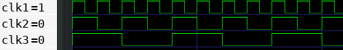
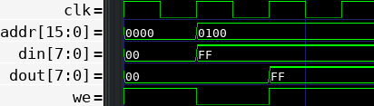
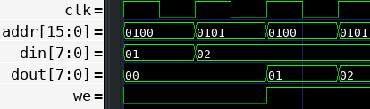

LuaSim
======

LuaSim is a tiny HDL simulation tool for Lua. It was initially made for developing a synthesizable fantasy console with Löve2d.

**Pending:** 
- Clock all the signals like real flip-flops on FPGA.
- Create a WIRE type.
- Wiring modules requires combinational logic at the top level (could be fixed with a new WIRE type).
- All the signals are registered on the global scope under the module namespace. Is it safe?

Usage
=====

Clocks
------

```lua
sim = require 'sim'

-- enable VCD output
sim.trace = true

-- create clocks
sim.create_clock('clk1', 2)
sim.create_clock('clk2', 3)
sim.create_clock('clk3', 4)

sim.start()

for i=0,100 do
  sim.update()
end
```



Sync RAM
--------

```lua
local ffi = require 'ffi'
sim = require 'sim'

-- enable VCD
sim.trace = true

sim.create_clock('clk', 2)
sim.create_signal('ram_we', 1)
sim.create_signal('ram_addr', 16)
sim.create_signal('ram_din', 8)
sim.create_signal('ram_dout', 8)

-- use FFI for unsigned int
memory = ffi.new('uint8_t[?]', 0xffff)

sim.always('clk', function()
  if ram.we == 0 then
    memory[ram.addr] = ram.din
  else
    ram.dout = memory[ram.addr]
  end
end)

sim.start()

-- start in read mode
ram.we = 1
sim.update()
sim.update()

-- write
ram.addr = 0x100
ram.we = 0
ram.din = 0xff
sim.update()
sim.update()

-- read
ram.we = 1
sim.update()
sim.update()
sim.update()
sim.update()
```



Async RAM
---------

```lua
local ffi = require 'ffi'
sim = require 'sim'

-- enable VCD
sim.trace = true

sim.create_clock('clk', 2)
sim.create_signal('ram_we', 1)
sim.create_signal('ram_addr', 16)
sim.create_signal('ram_din', 8)
sim.create_signal('ram_dout', 8)

memory = ffi.new('uint8_t[?]', 0xffff)

sim.comb({ 'ram_we', 'ram_din', 'ram_addr' }, function()
  if ram.we == 0 then
    memory[ram.addr] = ram.din
  else
    ram.dout = memory[ram.addr]
  end
end)

sim.start()

-- write

ram.addr = 0x100
ram.din = 0x01
sim.update()
sim.update()

ram.addr = 0x101
ram.din = 0x02
sim.update()
sim.update()

-- read
ram.we = 1
ram.addr = 0x100
sim.update()
sim.update()

ram.addr = 0x101
sim.update()
sim.update()
```




Usage with Love2d
-----------------

**Optional**: change the write method in sim.lua file if you still want to generate a VCD file:

```lua
-- love2d:
-- vcd_file, err = love.filesystem.newFile('dump.vcd')
-- vcd_file:open('w')
vcd_file = io.open('dump.vcd', 'w')
```

to

```lua
-- love2d:
vcd_file, err = love.filesystem.newFile('dump.vcd')
vcd_file:open('w')
-- vcd_file = io.open('dump.vcd', 'w')
```

In your main lua file:

```lua
sim = require 'sim'

-- include your modules
cpu = require 'cpu'
ram = require 'ram'

-- wire everything
sim.comb({ 'cpu_addr', 'ram_dout' }, function()
  ram.addr = cpu.addr
  cpu.din = ram.dout
end)

-- start the sim
-- You can specify the max simulation steps e.g. sim.start(100)
sim.start()

-- you can now initialize some values
cpu.reset = 0
cpu.PC = 0xfffe

function love.update(dt)
  for i=0,1000 do -- adjust for 60fps
    sim.update()
  end
end
```
